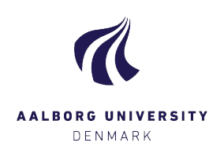
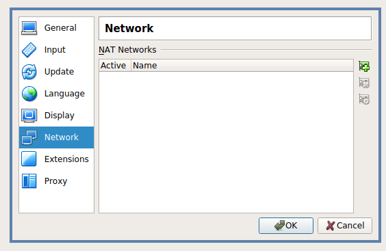
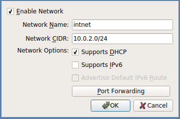
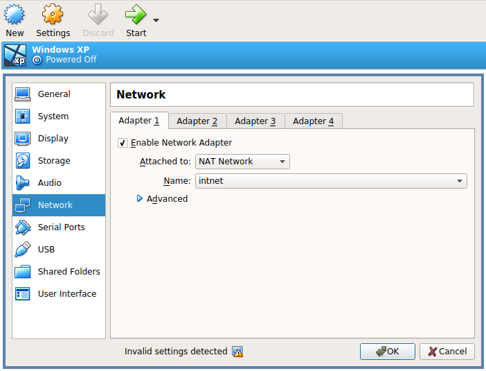

# Hack IT 2018 - Aalborg University Case

This repository contains files related to Aalborg University's case of [Hack IT 2018](https://dit.dk/da/Arrangementer/Disrupt-Denmark-for-students/HackIT2018).

## The Case: No trace left behind?
For years, the police has been working towards infiltrating a group of cynical criminals, working throughout all the major Danish cities: The group is assumed to control large parts of the underground economy, including trafficking, money laundring, drug trade, and assassinations. 
During a cold and stormy evening, a large number of specially trained policemen are ready for the big raid towards the supposed head quarters on an abandonned farm in a desolated area of Northern Jutland.
However, except for a party going on at the neighboring farm, they found that the crimials already left the buildings. 

There is nothing to be found – until a policeman stumbles upon an old computer. He is able to boot it, and reaches a Windows XP login screen.
There is only one user (username: LisbethSalander), but due to the password protection he is unable to login.

Maybe the computer carries the secrets the police are looking for?

*Hint: If you succeed all of the steps, you will locate a document containing the names and titles of the steering group of the network*

## Exercise
You have the two following virtual machines available:
* [Kali Linux machine](https://images.offensive-security.com/virtual-images/kali-linux-2017.3-vbox-i386.ova), which contains all the tools needed (and more) to solve the case **(attacker)**
* [The mentioned Windows XP Machine](https://drive.google.com/file/d/13I46Da6DuOc1hTyFLoFYFFEQPKyD7RUb/view?usp=sharing) **(target)**

*Please only download the images if you have no other way of getting them, preferably locally on the provided machine or USB-stick*

You will get full points if you solve the puzzle and identify the three persons of the steering group.
This is, however, a complicated task, so record your intermediate steps as you will also achieve points for these.

At the breakfast you will receive a list of the required information from the intermediate steps.
However, as this is also a help in order to solve the case it will not be provided from the beginning.

## Setting up the lab
The two virtual machines (VMs) are [VirtualBox](https://www.virtualbox.org/) images and can be imported like described [here](https://www.maketecheasier.com/import-export-ova-files-in-virtualbox/).
In essence, you need the two machines to have network access to each other.
One way of doing this is creating a NAT Network in VirtualBox, which can be done in the following steps:

1) Open Preferences (*File => Preferences* or CTRL+G)
2) Then navigate to network preferences, and click the small network card with a plus sign.

3) Select a name for the network, and **make sure DHCP is ticked**. Press 'OK'.

4) Access settings of each of the VMs, and make sure like they are connected to the newly created network.

